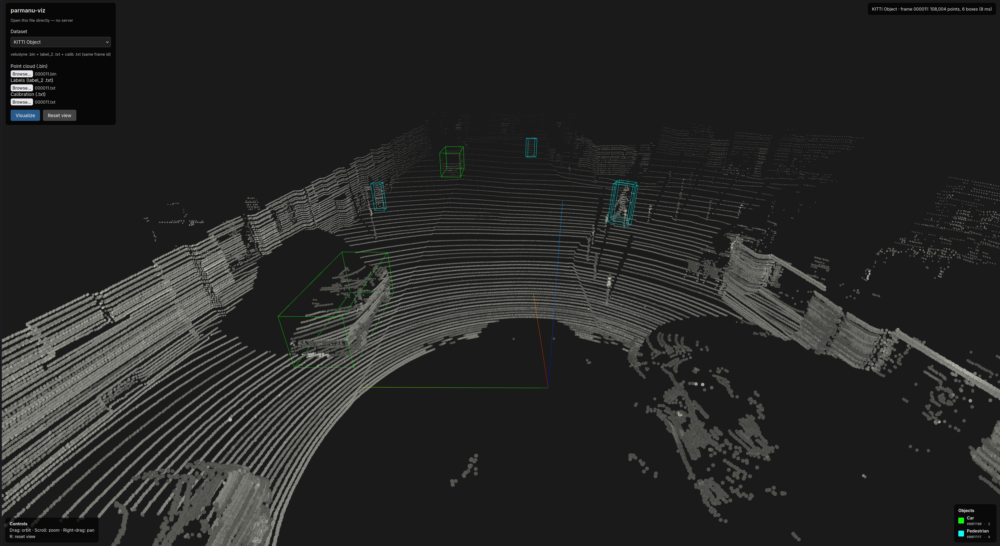
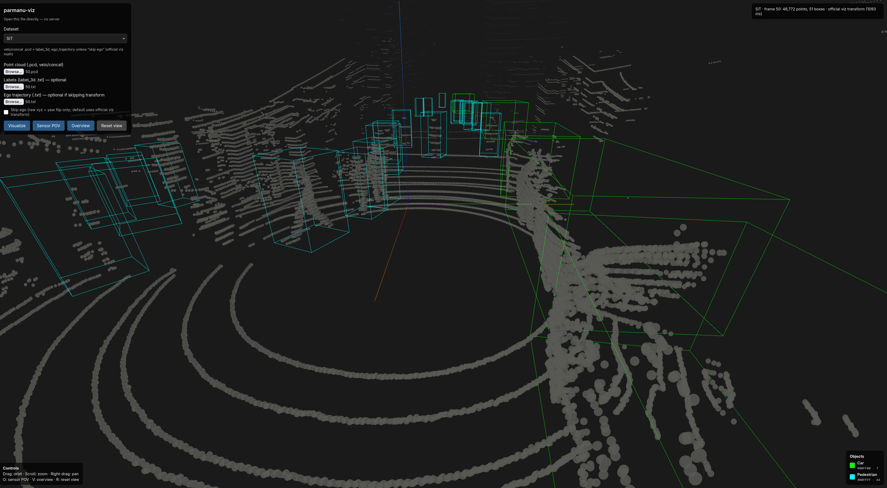

# parmanu-viz: Browser-Based 3D Point Cloud Visualization

**VR (WebXR):** Meta Quest 3 and immersive browsers — see [Viewing in VR](#viewing-in-vr-meta-quest-3).

## Philosophy & Vision

**parmanu-viz** (Sanskrit: "parmanu" = atom/particle) is built on core principles:

- **Simplicity First**: Zero installation, zero dependencies, zero complexity. Just open a browser and start visualizing.
- **Offline-First**: Works completely offline after initial load. No servers, no cloud, no internet required.
- **Open Source**: Built for the community, by the community. Extensible and transparent.
- **Extensibility**: Adding support for new datasets should be as simple as adding one JavaScript file. No core modifications needed.
- **Ease of Use**: Researchers should spend time on research, not fighting with tools. Click, select, visualize.
- **No Data Transformations Required**: Just download the official datasets and select files to load. Automatically handles ego transformations, calibrations etc.
- **Zero Setup Required**: No python or JS dependencies to fight with.






## Supported Datasets
- **KITTI Object** — `.bin` + `label_2` + calib
- **SiT** — `velo/concat` `.pcd` + optional `label_3d` + `ego_trajectory` (browser-only, no conversion)

## Usage

1. Open `index.html` in your browser.
2. Choose **Dataset** in the panel.

### KITTI

Select three files for the same frame (e.g. `000001`):

- `data_object_velodyne/training/velodyne/000001.bin`
- `data_object_label_2/training/label_2/000001.txt`
- `data_object_calib/training/calib/000001.txt`

### SiT

- **Point cloud (required):** `{scene}/{seq}/velo/concat/data/{frame}.pcd`
- **Labels (optional):** `{scene}/{seq}/label_3d/{frame}.txt` — if provided, also pick **ego trajectory** `{scene}/{seq}/ego_trajectory/{frame}.txt` with the same frame id.
- Sequences without `label_3d` (e.g. `Lobby_1`): pick `.pcd` only for points-only view.

3. Click **Visualize**.

Controls: drag to orbit, scroll to zoom, right-drag to pan, **R** to reset view.

## Viewing in VR (Meta Quest 3)

parmanu-viz supports **immersive WebXR** in the Quest Browser (and other WebXR browsers). You view the same point cloud and 3D boxes as on desktop, and move with the Touch controllers.

### Quick start (GitHub Pages + files on the headset)

1. On your PC, copy one frame’s files into a folder, e.g. `parmanu/`:
   - **KITTI:** `000001.bin`, `000001.txt` (label_2), `000001.txt` (calib)
   - **SiT:** `{frame}.pcd` and optional label/ego `.txt` files
2. Transfer that folder to the headset (USB cable → **Internal storage/Download/parmanu/**, or `adb push` — see below).
3. Put on the headset and open **Quest Browser**.
4. Go to the live app: [https://ankk98.github.io/parmanu-viz/](https://ankk98.github.io/parmanu-viz/)
5. Choose the dataset, tap each file input, and pick files from **Download/parmanu/**.
6. Tap **Visualize**, then tap **Enter VR** (bottom of the view).
7. Use the controllers:
   - **Left stick:** walk and strafe
   - **Left grip + stick up/down:** change height
   - **Right stick:** turn and look up/down
   - **Trigger (point at floor):** teleport
   - **Right grip:** show/hide help and legend panels

### If “Enter VR” does not appear

- Use **Quest Browser** (not a non-XR browser).
- The site must be **HTTPS** (GitHub Pages is fine; `file://` will not work).
- In Quest Browser, open `chrome://flags` and ensure **WebXR** is enabled.
- Reload the page after enabling flags.

### Developer option: PC and headset on the same Wi‑Fi

Serve the repo from your computer so the headset loads the app over the LAN:

```bash
cd parmanu-viz
python -m http.server 8000 --bind 0.0.0.0
```

On the Quest, open `http://<your-pc-ip>:8000/` (replace with your computer’s LAN address). Then pick files and use **Enter VR** as above.

### Copy files with ADB (optional)

```bash
adb push 000001.bin /sdcard/Download/parmanu/
adb push 000001.txt /sdcard/Download/parmanu/   # repeat for label and calib files
```

### Comfort

- Teleport reduces motion sickness compared to stick-only movement; use trigger on the floor when possible.
- Stand or sit with space to move your arms.
- Large KITTI frames may use automatic point subsampling in VR to keep framerate smooth.

## Architecture

### Technology Stack

- **Frontend**: Pure HTML + JavaScript
- **3D Rendering**: Three.js (bundled locally for offline support)
- **File Access**: Per-file pickers (v1)
- **Deployment**: GitHub Pages (static hosting)

## Files

| Script | Role |
|--------|------|
| `assets/three.min.js` | Three.js r134 (global `THREE`) |
| `assets/OrbitControls.js` | Orbit controls |
| `assets/PCDLoader.js` | SiT `.pcd` loader (`binary_compressed`) |
| `assets/VRButton.js` | WebXR Enter/Exit VR button |
| `js/vr.js` | WebXR session, controllers, locomotion |
| `js/datasets/registry.js` | Dataset registry + selector |
| `js/datasets/kitti.js` | KITTI parsers + box math |
| `js/datasets/sit.js` | SiT PCD + label_3d + ego |
| `js/viewer.js` | Point cloud + 3D boxes |
| `js/explorer.js` | KITTI file pickers |
| `js/app.js` | Wiring |

Plain `<script>` tags — no npm, no build, no ES modules.

### Add another dataset

1. Add `js/datasets/waymo.js` with `WaymoLoader` and `loadFrame()` returning `{ points, boxes }`.
2. Register in that file: `DatasetRegistry.register('waymo', { name, fileHint, Loader, createExplorer })`.
3. Add `<script src="js/datasets/waymo.js"></script>` to `index.html` after the other dataset scripts.

The **Dataset** dropdown updates automatically.

## KITTI math

Ported from the [KITTI object devkit](https://github.com/bostondiditeam/kitti) / [kitti_object_vis](https://github.com/kuixu/kitti_object_vis). Optional local clones under `.reference/` for development only.

## Contributions welcome

Issues, ideas, and pull requests are welcome. You do not need to set up a build step or install dependencies — the project is plain HTML and JavaScript.

Ways to help:

- **New datasets** — add a loader under `js/datasets/` and register it (see [Add another dataset](#add-another-dataset) above).
- **Bug fixes and UX** — viewer controls, file pickers, labeling, or calibration edge cases.
- **Docs and examples** — clearer usage notes, screenshots, or dataset-specific guides.

To contribute:

1. Fork the repo and create a branch for your change.
2. Test by opening `index.html` locally with sample data from a supported dataset.
3. Open a pull request with a short description of what changed and how you tested it.

For larger changes (new dataset formats, rendering changes), open an issue first so we can align on approach.

## License

MIT — see [LICENSE](LICENSE).
